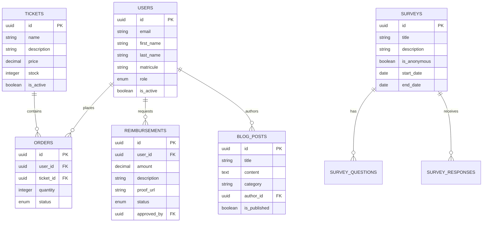
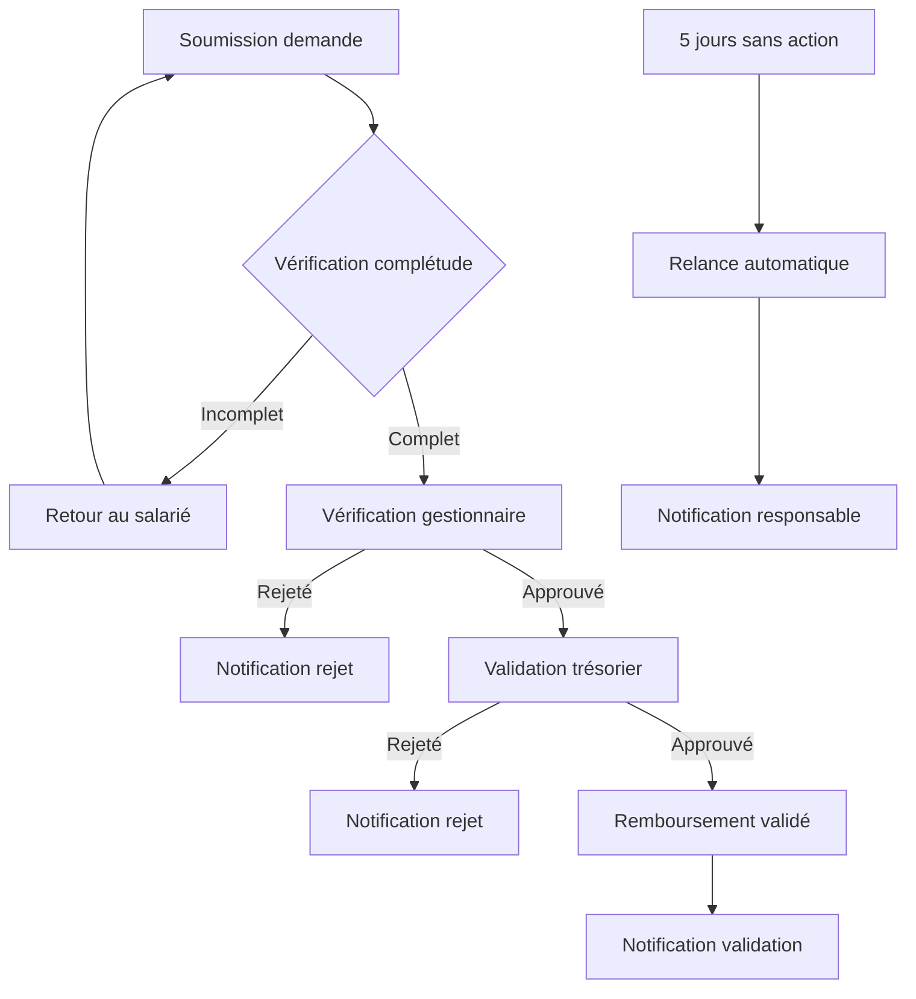
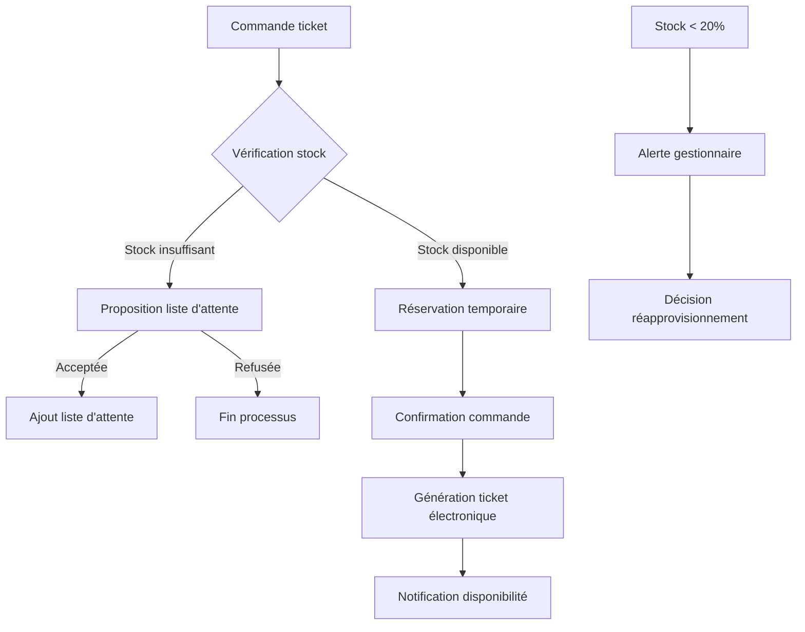

# Document des Exigences Produit (PRD)

# CSE Les PEP 973 - Application Web de Gestion

**Version:** 1.1  
**Date:** 25 Juillet 2025  
**Auteur:** Équipe Technique CSE Les PEP 973

## Table des matières

1. [Objectifs](#1-objectifs)
2. [Personas Utilisateurs](#2-personas-utilisateurs)
3. [Spécifications Fonctionnelles](#3-spécifications-fonctionnelles)
4. [Architecture Technique](#4-architecture-technique)
5. [Expérience Utilisateur (UX)](#5-expérience-utilisateur-ux)
6. [Règles Métiers et Workflows](#6-règles-métiers-et-workflows)
7. [Administration et Évolutivité](#7-administration-et-évolutivité)
8. [Sécurité et Conformité RGPD](#8-sécurité-et-conformité-rgpd)
9. [Reporting et Tableaux de Bord](#9-reporting-et-tableaux-de-bord)
10. [Gestion du Changement](#10-gestion-du-changement)
11. [Exigences Non-Fonctionnelles](#11-exigences-non-fonctionnelles)
12. [Gestion Proactive des Risques](#12-gestion-proactive-des-risques)
13. [Roadmap & Livrables](#13-roadmap--livrables)

---

## 1. Objectifs

### 1.1 Vision du Produit

L'application web du CSE Les PEP 973 vise à moderniser et centraliser la gestion des activités du Comité Social et Économique. Cette plateforme permettra d'améliorer la communication interne, de simplifier les processus administratifs et d'offrir une meilleure expérience aux salariés bénéficiaires.

### 1.2 Objectifs Métier

| Objectif                            | Description                                                   | KPI                                      |
| ----------------------------------- | ------------------------------------------------------------- | ---------------------------------------- |
| Améliorer l'engagement des salariés | Augmenter la participation aux activités et événements du CSE | Taux de participation +30%               |
| Optimiser la gestion des tickets    | Réduire le temps de traitement des commandes de tickets       | Temps moyen réduit de 75%                |
| Simplifier les remboursements       | Dématérialiser le processus de demande et validation          | Délai de traitement < 5 jours            |
| Centraliser la communication        | Créer un point d'accès unique aux informations du CSE         | 90% des communications via la plateforme |

### 1.3 Critères de Succès

- Adoption par 85% des salariés dans les 3 premiers mois
- Réduction de 70% des tâches administratives manuelles
- Satisfaction utilisateur > 4.2/5 (enquête post-déploiement)
- Conformité RGPD complète

---

## 2. Personas Utilisateurs

### 2.1 Salarié Standard

**Profil:** Employé des PEP 973 avec accès aux avantages du CSE  
**Besoins:**

- Consulter les actualités et événements du CSE
- Commander des tickets pour événements
- Soumettre des demandes de remboursement
- Mettre à jour ses informations personnelles

**Parcours utilisateur:**

1. Se connecte avec ses identifiants professionnels
2. Consulte les actualités récentes sur la page d'accueil
3. Accède à son espace personnel pour suivre ses demandes
4. Commande des tickets ou soumet une demande de remboursement

### 2.2 Salarié Très Occasionnel

**Profil:** Employé utilisant rarement les services du CSE  
**Besoins:**

- Interface simple et intuitive
- Accès rapide aux fonctionnalités essentielles
- Processus simplifiés avec minimum d'étapes
- Aide contextuelle facilement accessible

**Parcours utilisateur:**

1. Se connecte avec ses identifiants professionnels
2. Accède directement à la fonctionnalité recherchée via le menu principal
3. Complète rapidement sa demande avec assistance guidée
4. Reçoit une confirmation claire de son action

### 2.3 Salarié Régulier

**Profil:** Employé utilisant fréquemment les services du CSE  
**Besoins:**

- Accès rapide à l'historique de ses demandes
- Suivi détaillé de ses commandes et remboursements
- Notifications personnalisées sur les nouveaux avantages
- Gestion efficace de son profil et préférences

**Parcours utilisateur:**

1. Se connecte avec ses identifiants professionnels
2. Consulte son tableau de bord personnalisé
3. Accède à son historique complet de commandes et remboursements
4. Effectue de nouvelles demandes avec des formulaires pré-remplis

### 2.4 Gestionnaire CSE

**Profil:** Membre du CSE chargé de la gestion quotidienne  
**Besoins:**

- Gérer le stock de tickets
- Valider les commandes
- Examiner les demandes de remboursement
- Publier des actualités et créer des sondages

**Parcours utilisateur:**

1. Se connecte avec ses identifiants renforcés (2FA)
2. Accède au tableau de bord administratif
3. Traite les demandes en attente
4. Gère les stocks et publie du contenu

### 2.5 Trésorier

**Profil:** Responsable financier du CSE  
**Besoins:**

- Valider les remboursements
- Suivre les dépenses et le budget
- Générer des rapports financiers
- Définir les règles de remboursement

**Parcours utilisateur:**

1. Se connecte avec authentification renforcée
2. Accède au module financier
3. Valide les demandes de remboursement
4. Génère des rapports et ajuste les paramètres

### 2.6 Administrateur

**Profil:** Responsable technique de la plateforme  
**Besoins:**

- Gérer les utilisateurs et leurs droits
- Configurer les paramètres système
- Surveiller les performances
- Effectuer des sauvegardes et maintenance

**Parcours utilisateur:**

1. Se connecte avec droits d'administration
2. Accède à la console d'administration
3. Gère les comptes utilisateurs et les paramètres
4. Surveille les métriques système

### 2.7 Élu du CSE

**Profil:** Membre élu représentant les salariés  
**Besoins:**

- Accès aux informations globales d'utilisation
- Consultation des rapports périodiques
- Communication facilitée avec les salariés
- Suivi des indicateurs clés de performance

**Parcours utilisateur:**

1. Se connecte avec ses identifiants spécifiques
2. Consulte le tableau de bord des élus
3. Accède aux rapports et statistiques d'utilisation
4. Communique avec les salariés via la plateforme

---

## 3. Spécifications Fonctionnelles

### 3.1 Authentification et Gestion des Utilisateurs

#### 3.1.1 Inscription et Connexion

- Authentification par email/mot de passe
- Intégration avec Google OAuth
- Authentification à deux facteurs (2FA)
- Récupération de mot de passe sécurisée

#### 3.1.2 Gestion des Profils

- Édition des informations personnelles
- Gestion des préférences de notification
- Historique des activités
- Gestion des rôles et permissions

### 3.2 Espace Blog et Communication

#### 3.2.1 Publication d'Articles

- Éditeur WYSIWYG avec support multimédia
- Catégorisation des articles
- Planification des publications
- Statistiques de lecture

#### 3.2.2 Questionnaires et Sondages

- Création de formulaires personnalisés
- Support de questions à choix multiples, texte libre
- Sondages anonymes ou nominatifs
- Analyse des résultats et exportation

### 3.3 Gestion des Tickets

#### 3.3.1 Catalogue de Tickets

- Affichage des tickets disponibles avec description
- Indication de stock en temps réel
- Filtrage par catégorie et prix
- Historique des achats précédents

#### 3.3.2 Processus de Commande

- Panier d'achat multi-tickets
- Validation des limites par utilisateur
- Confirmation par email
- Suivi de statut de commande

#### 3.3.3 Distribution et Gestion

- Génération de QR codes pour tickets électroniques
- Système de validation lors de la distribution
- Gestion des annulations et remboursements
- Rapports de vente et distribution

#### 3.3.4 Gestion Avancée des Stocks

- Liste d'attente automatique lorsque les stocks sont épuisés
- Notifications aux utilisateurs quand les tickets redeviennent disponibles
- Règles claires pour les annulations tardives
- Alertes automatiques pour réapprovisionnement des stocks critiques

### 3.4 Remboursements Conditionnels

#### 3.4.1 Soumission de Demandes

- Formulaire de demande avec upload de justificatifs
- Calcul automatique du montant remboursable (50%, max 200€/an)
- Suivi de l'historique des demandes
- Notifications de statut

#### 3.4.2 Processus de Validation

- Workflow à deux niveaux (gestionnaire puis trésorier)
- Interface d'examen des justificatifs
- Commentaires internes pour chaque demande
- Traçabilité des décisions

#### 3.4.3 Suivi Budgétaire

- Tableau de bord des remboursements par période
- Suivi des plafonds individuels
- Alertes de dépassement budgétaire
- Rapports financiers exportables

#### 3.4.4 Gestion des Cas Exceptionnels

- Interface dédiée pour les remboursements exceptionnels
- Traçabilité spécifique des exceptions validées
- Notification d'atteinte de plafond (à 80% du maximum annuel)
- Documentation des cas de force majeure

### 3.5 Administration et Paramétrage

#### 3.5.1 Gestion des Paramètres

- Configuration des règles de remboursement
- Définition des limites de commande
- Personnalisation de l'interface
- Gestion des notifications système

#### 3.5.2 Reporting et Analytics

- Tableaux de bord interactifs
- Métriques d'utilisation et engagement
- Rapports périodiques automatisés
- Export des données au format Excel/CSV

#### 3.5.3 Import de Données

- Import Excel des bénéficiaires
- Validation et gestion des erreurs (doublons, incohérences)
- Génération de rapports post-import
- Possibilité de rollback en cas d'erreur

---

## 4. Architecture Technique

### 4.1 Stack Technologique

#### 4.1.1 Frontend

- **Framework:** Next.js 14 avec App Router
- **Langage:** TypeScript
- **UI:** React avec Tailwind CSS et shadcn/ui
- **État:** React Context et SWR pour la gestion des données
- **Formulaires:** React Hook Form avec Zod pour la validation

#### 4.1.2 Backend

- **Infrastructure:** Supabase
- **Base de données:** PostgreSQL
- **Authentification:** Supabase Auth avec JWT
- **Stockage:** Supabase Storage pour les fichiers
- **API:** REST via Supabase et API Routes Next.js

#### 4.1.3 Déploiement

- **Hébergement:** Vercel
- **CI/CD:** GitHub Actions
- **Monitoring:** Vercel Analytics et Sentry
- **Domaine et SSL:** Vercel avec certificats automatiques

### 4.2 Schéma de Base de Données

La base de données PostgreSQL est structurée autour des entités principales suivantes:

### 4.3 Sécurité et Contrôle d'Accès

- **Authentification:** JWT avec expiration courte et refresh tokens
- **Autorisation:** Row Level Security (RLS) au niveau base de données
- **Rôles:** Système de permissions basé sur les rôles (RBAC)
- **Protection des données:** Chiffrement en transit (HTTPS) et au repos
- **Validation:** Validation côté client et serveur avec schémas Zod

### 4.4 Intégrations

- **Email:** SendGrid pour les notifications
- **Stockage:** Supabase Storage pour les pièces justificatives
- **Authentification:** Google OAuth
- **Paiements:** (Prévu pour phase ultérieure)

---

## 5. Expérience Utilisateur (UX)

### 5.1 Principes Directeurs UX

- **Simplicité:** Interfaces épurées et intuitives
- **Accessibilité:** Conformité WCAG 2.1 niveau AA
- **Cohérence:** Patterns d'interaction uniformes
- **Feedback:** Retour visuel immédiat pour chaque action
- **Efficacité:** Minimisation des étapes pour les tâches fréquentes

### 5.2 Parcours Utilisateurs Optimisés

#### 5.2.1 Accès Rapide aux Remboursements

1. Accès direct depuis le tableau de bord
2. Formulaire simplifié avec aide contextuelle
3. Upload de justificatifs par glisser-déposer
4. Confirmation immédiate et suivi de statut clair

#### 5.2.2 Suivi des Commandes de Tickets

1. Visualisation claire de l'historique des commandes
2. Filtrage par statut et date
3. Notifications automatiques de changement de statut
4. Accès direct aux tickets électroniques

#### 5.2.3 Gestion des Notifications

- Paramétrage fin des notifications par type
- Regroupement intelligent des notifications
- Choix du canal (email, in-app, SMS)
- Fréquence personnalisable (instantanée, quotidienne, hebdomadaire)

### 5.3 Livrables UX

- **Maquettes interactives:** Prototype Figma pour validation utilisateur
- **Guide de style:** Composants UI, typographie, couleurs, iconographie
- **Tests utilisateurs:** Sessions de test avec représentants de chaque persona
- **Heatmaps:** Analyse des interactions pour optimisation continue

---

## 6. Règles Métiers et Workflows

### 6.1 Règles Métiers Consolidées

#### 6.1.1 Gestion des Tickets

- Limite de commande: 5 tickets par type par mois par salarié
- Période d'annulation: Jusqu'à 30 jours avant l'événement
- Gestion des listes d'attente: Priorité par ordre chronologique
- Réapprovisionnement: Alerte automatique à 20% du stock restant

#### 6.1.2 Remboursements

- Taux standard: 50% du montant des activités éligibles
- Plafond annuel: 200€ par salarié par année civile
- Notification d'atteinte de plafond: Alerte à 80% (160€)
- Délai de soumission: Jusqu'à 3 mois après la date de l'activité

### 6.2 Workflows Métiers Critiques

#### 6.2.1 Validation des Remboursements

#### 6.2.2 Gestion des Commandes de Tickets

### 6.3 Livrables Règles Métiers

- **Fiches métiers:** Documentation détaillée avec exemples concrets
- **Diagrammes BPMN:** Représentation visuelle des processus critiques
- **Matrice de décision:** Arbre de décision pour les cas particuliers
- **Guide administrateur:** Procédures de modification des règles métiers

---

## 7. Administration et Évolutivité

### 7.1 Interface d'Administration

- **Tableau de bord:** Vue d'ensemble des métriques clés
- **Gestion utilisateurs:** Création, modification, désactivation
- **Configuration système:** Paramètres globaux et par module
- **Logs système:** Suivi des actions et erreurs

### 7.2 Paramétrage Autonome

- **Règles métiers:** Interface de modification sans intervention technique
- **Formulaires:** Éditeur de champs et validation
- **Notifications:** Configuration des modèles et déclencheurs
- **Workflows:** Ajustement des étapes et approbations

### 7.3 Modularité

- **Activation/désactivation:** Contrôle individuel des modules
- **Dépendances:** Gestion claire des relations entre modules
- **Versions:** Possibilité de déploiement progressif des fonctionnalités
- **Extensions:** Architecture permettant l'ajout de modules personnalisés

### 7.4 Livrables Administration

- **Back-office simplifié:** Interface administrateur intuitive
- **Documentation vidéo:** Tutoriels pour les tâches administratives courantes
- **Guide PDF:** Manuel complet d'administration système
- **Formation:** Sessions dédiées pour les administrateurs

---

## 8. Sécurité et Conformité RGPD

### 8.1 Politique d'Accès aux Données

- **Matrice RBAC:** Définition précise des droits par rôle
- **Principe du moindre privilège:** Accès limité au strict nécessaire
- **Séparation des responsabilités:** Validation multi-niveaux pour actions sensibles
- **Journalisation:** Traçabilité complète des accès et modifications

### 8.2 Protection des Données Sensibles

- **Chiffrement:** Données personnelles et justificatifs chiffrés au repos
- **Anonymisation:** Options d'anonymisation pour les rapports
- **Accès restreint:** Contrôle strict des accès aux justificatifs
- **Durée de conservation:** Politique claire de rétention des données

### 8.3 Conformité RGPD

- **Consentement:** Gestion explicite des consentements utilisateurs
- **Droit à l'oubli:** Procédure automatisée de suppression des données
- **Portabilité:** Export des données personnelles au format standard
- **Registre de traitement:** Documentation complète des traitements de données

### 8.4 Livrables Sécurité et RGPD

- **Matrice RGPD:** Tableau Excel détaillant les traitements et conformité
- **Politique de confidentialité:** Document légal pour les utilisateurs
- **Procédures de sécurité:** Guide des bonnes pratiques pour administrateurs
- **Plan d'audit:** Calendrier des vérifications périodiques

---

## 9. Reporting et Tableaux de Bord

### 9.1 Tableaux de Bord Utilisateurs

- **Salarié:** Suivi des demandes, plafond de remboursement, tickets disponibles
- **Gestionnaire:** Demandes en attente, stocks critiques, activité récente
- **Trésorier:** État des remboursements, budget consommé, projections
- **Administrateur:** Métriques système, activité utilisateurs, performances

### 9.2 Rapports Automatisés

- **Rapports quotidiens:** Activité de la journée, alertes, tâches en attente
- **Rapports hebdomadaires:** Synthèse d'activité, tendances, prévisions
- **Rapports trimestriels:** Analyse approfondie pour les élus du CSE
- **Rapports annuels:** Bilan complet d'utilisation et recommandations

### 9.3 Métriques Clés

- **Engagement:** Taux d'utilisation par service, fréquence de connexion
- **Performance:** Temps de traitement, taux de validation, délais moyens
- **Satisfaction:** Feedback utilisateurs, taux de complétion, abandons
- **Financier:** Budget consommé, économies réalisées, projections

### 9.4 Livrables Reporting

- **Tableaux de bord interactifs:** Interfaces Power BI ou équivalent
- **Modèles de rapports:** Templates personnalisables par rôle
- **Documentation:** Guide d'interprétation des métriques
- **Formation:** Sessions d'analyse pour les décideurs

---

## 10. Gestion du Changement

### 10.1 Plan de Communication

- **Annonce préalable:** Communication progressive avant lancement
- **Présentation:** Webinaires de démonstration par module
- **Supports:** Vidéos tutorielles, guides PDF, infographies
- **Feedback:** Canaux dédiés pour questions et suggestions

### 10.2 Formation Utilisateurs

- **Sessions par profil:** Formation adaptée à chaque type d'utilisateur
- **Ateliers pratiques:** Exercices sur cas réels
- **Certification:** Validation des compétences pour administrateurs
- **Support continu:** Assistance post-formation

### 10.3 Adoption Progressive

- **Utilisateurs pilotes:** Groupe test représentatif
- **Déploiement par phase:** Introduction progressive des fonctionnalités
- **Période de transition:** Coexistence temporaire avec anciens systèmes
- **Mesure d'adoption:** Suivi des métriques d'utilisation et ajustements

### 10.4 Livrables Gestion du Changement

- **Kit de communication:** Emails types, affiches, présentations
- **FAQ dynamique:** Base de connaissances évolutive
- **Guide utilisateur:** Manuel complet par profil
- **Plan de formation:** Calendrier et contenu des sessions

---

## 11. Exigences Non-Fonctionnelles

### 11.1 Performance

- **Temps de chargement:** < 2 secondes pour la page d'accueil
- **Temps de réponse API:** < 500ms pour 95% des requêtes
- **Capacité:** Support de 500 utilisateurs simultanés
- **Optimisation:** Images optimisées, code minifié, lazy loading

### 11.2 Disponibilité et Fiabilité

- **SLA:** 99.9% de disponibilité
- **Sauvegarde:** Quotidienne avec rétention de 30 jours
- **Reprise après sinistre:** RTO < 4 heures, RPO < 24 heures
- **Monitoring:** Alertes en temps réel sur incidents

### 11.3 Sécurité et Conformité

- **RGPD:** Conformité complète (consentement, droit à l'oubli)
- **Audit:** Journalisation des actions sensibles
- **Vulnérabilités:** Scan régulier et correction prioritaire
- **Données sensibles:** Chiffrement des données personnelles

### 11.4 Accessibilité et Compatibilité

- **Accessibilité:** Conformité WCAG 2.1 niveau AA
- **Responsive:** Support mobile, tablette et desktop
- **Navigateurs:** Chrome, Firefox, Safari, Edge (2 dernières versions)
- **Offline:** Fonctionnalités de base disponibles hors connexion

### 11.5 Maintenance et Évolutivité

- **Code:** Documentation complète et tests automatisés
- **Architecture:** Modulaire pour faciliter les extensions
- **Déploiement:** Zero-downtime deployments
- **Scalabilité:** Architecture permettant la montée en charge

---

## 12. Gestion Proactive des Risques

### 12.1 Matrice des Risques

| Risque identifié                           | Niveau | Impact   | Probabilité | Solution préventive proposée                                                      |
| ------------------------------------------ | ------ | -------- | ----------- | --------------------------------------------------------------------------------- |
| Faible adoption par les salariés           | Moyen  | Élevé    | Moyenne     | Communication renforcée, vidéos tutorielles, sessions de formation                |
| Erreurs fréquentes d'import Excel          | Élevé  | Moyen    | Élevée      | Vérifications automatiques renforcées, modèles standardisés, validation préalable |
| Sécurité des données (fuites potentielles) | Élevé  | Critique | Faible      | Audits périodiques, authentification 2FA stricte, chiffrement renforcé            |
| Retard de validation des remboursements    | Moyen  | Moyen    | Élevée      | Relances automatiques, rappels réguliers, escalade hiérarchique                   |
| Indisponibilité du système                 | Élevé  | Élevé    | Faible      | Architecture redondante, monitoring proactif, plan de continuité                  |
| Résistance au changement                   | Moyen  | Élevé    | Moyenne     | Formation approfondie, accompagnement personnalisé, communication des bénéfices   |

### 12.2 Plan de Mitigation

- **Identification précoce:** Mécanismes de détection des problèmes potentiels
- **Réponse graduée:** Procédures adaptées au niveau de risque
- **Responsabilités claires:** Attribution des rôles en cas d'incident
- **Révision périodique:** Mise à jour régulière de la matrice des risques

### 12.3 Plan de Continuité

- **Procédures dégradées:** Modes de fonctionnement alternatifs
- **Restauration:** Processus de récupération après incident
- **Communication de crise:** Modèles et canaux prédéfinis
- **Tests réguliers:** Simulation d'incidents pour validation des procédures

---

## 13. Roadmap & Livrables

### 13.1 Phases de Développement

#### Phase 1: MVP (T3 2025)

- Authentification et gestion des profils
- Catalogue de tickets et commandes basiques
- Formulaires de remboursement simples
- Blog avec fonctionnalités essentielles

#### Phase 2: Fonctionnalités Avancées (T4 2025)

- Système de questionnaires et sondages
- Workflow complet de validation des remboursements
- Tableau de bord analytique
- Notifications avancées

#### Phase 3: Optimisation et Extensions (T1 2026)

- Application mobile (PWA)
- Intégration de paiements en ligne
- Système de billetterie électronique
- Fonctionnalités communautaires

### 13.2 Jalons Clés

| Jalon   | Date       | Livrables                                             |
| ------- | ---------- | ----------------------------------------------------- |
| Kickoff | 01/08/2025 | Document de spécifications finalisé                   |
| Alpha   | 15/09/2025 | Prototype fonctionnel pour tests internes             |
| Beta    | 01/11/2025 | Version test pour groupe d'utilisateurs pilotes       |
| MVP     | 15/12/2025 | Lancement de la version minimale viable               |
| V1.0    | 01/02/2026 | Version complète avec toutes les fonctionnalités core |

### 13.3 Stratégie de Test et Validation

- **Tests unitaires:** Couverture > 80% du code
- **Tests d'intégration:** Validation des workflows critiques
- **Tests utilisateurs:** Sessions avec représentants de chaque persona
- **Beta testing:** Groupe pilote de 20 utilisateurs pendant 3 semaines

### 13.4 Plan de Formation et Déploiement

- **Documentation:** Guide utilisateur et administrateur
- **Formation:** Sessions dédiées pour chaque type d'utilisateur
- **Support:** Mise en place d'un système de tickets et FAQ
- **Déploiement:** Stratégie progressive avec période de coexistence

---

## Annexes

### A. Glossaire

- **CSE:** Comité Social et Économique
- **2FA:** Authentification à Deux Facteurs
- **RLS:** Row Level Security (Sécurité au Niveau des Lignes)
- **RBAC:** Role-Based Access Control (Contrôle d'Accès Basé sur les Rôles)
- **SLA:** Service Level Agreement (Accord de Niveau de Service)
- **RTO:** Recovery Time Objective (Objectif de Temps de Reprise)
- **RPO:** Recovery Point Objective (Objectif de Point de Reprise)
- **UX:** User Experience (Expérience Utilisateur)
- **BPMN:** Business Process Model and Notation (Modélisation des Processus Métier)

### B. Références

- Réglementation CSE: [Lien vers la documentation légale]
- Documentation Supabase: https://supabase.com/docs
- Documentation Next.js: https://nextjs.org/docs
- Normes RGPD: https://www.cnil.fr/fr/rgpd-par-ou-commencer
- Guide WCAG 2.1: https://www.w3.org/TR/WCAG21/

### C. Livrables Complémentaires

- Maquettes Figma: [Lien vers le projet Figma]
- Diagrammes BPMN: [Lien vers les diagrammes]
- Matrice RGPD: [Lien vers le document Excel]
- Kit de communication: [Lien vers les ressources]

---

_Document approuvé par:_

- [Nom], Président du CSE
- [Nom], Responsable Technique
- [Nom], Représentant des Utilisateurs

_Date d'approbation: [Date]_
